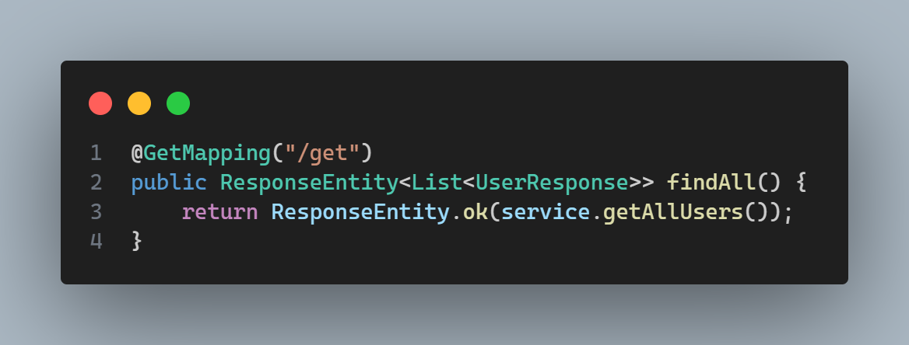
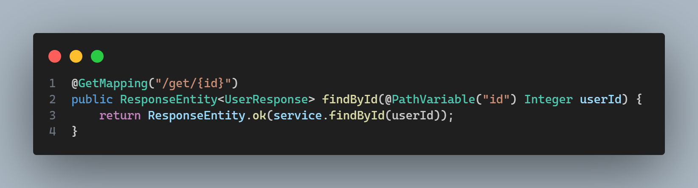
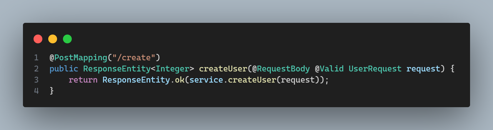
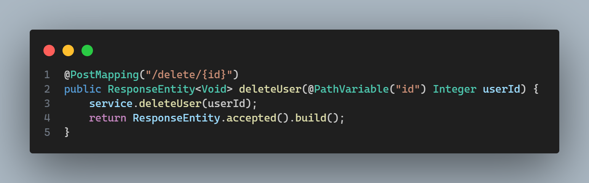

# Fluxo-Usuario

http://localhost:8080/swagger-ui/index.html

 

Recebe uma requisição do tipo GET para retornar todos os usuários cadastrados.
 
Recieves an request type GET to return all the users registered.

Recebe uma requisição do tipo GET para retornar o usuario cadastrado a partir do login informado, quando for o caso.
 
Recieves an request type GET to return the user registered based on the login inserted.

Recebe uma requisição do tipo POST para CADASTRAR usuario e responde com o usuario cadastrado.
Caso o usuario tentar se CADASTRAR e retornar com o usuario existente, ja existe um usuario com informações 
requisitadas ja em uso no banco.
 
Recieves an request type POST to REGISTER user and returns with the user registered.
But if the user try to REGISTER and returns with existent user, already exist and user with
the request info on user in the database.

Recebe uma requisição do tipo POST para excluir o usuario a partir do login informado e responde com a confirmação da exclusão.
Ou quando acontece um erro ele retorna com a impossibilidade de exclusão e a justificativa do erro.
 
Recieves an request type POST to delete the user based on the login informed and returns with the confirmation of exclusion 
Or when happens an error it returns with the impossibility of exclusion and with the justify of the error.  

Postman em manutenção 
 
Postman in maintenance 
👨🏾‍🔧 https://documenter.getpostman.com/view/38340143/2sAY4vi3vF 👨🏾‍🔧

 
Tem todo o teste da api e como funciona a aplicação funciona.
 
Quando você clicar no programa pra acessar utilize o site acima.
 

 
There haves the working api test and how the application works.
 
When you click on the program and access use the webpage up there.
 

