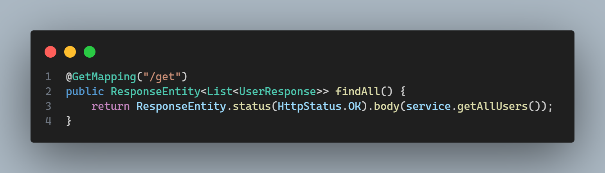
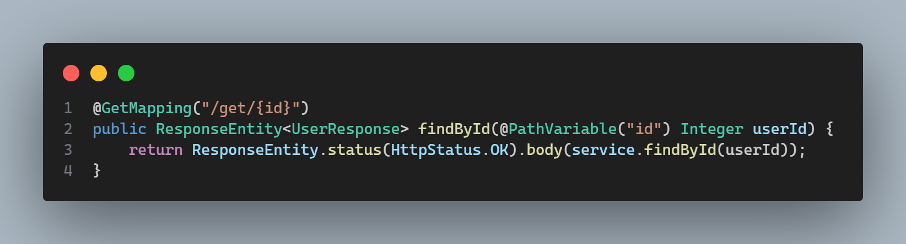
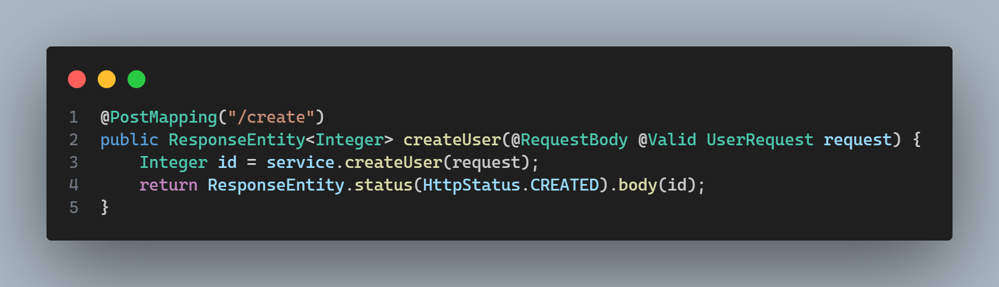
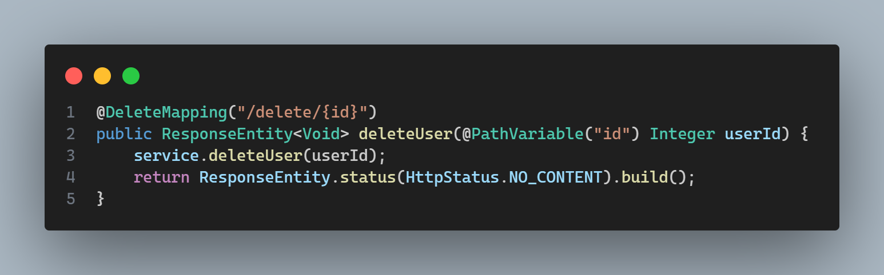

# Fluxo-Usuario
#### [Swagger](http://localhost:8080/swagger-ui/index.html)

Recebe uma requisição do tipo GET para retornar todos os usuários cadastrados.

 
Recebe uma requisição do tipo GET para retornar o usuario cadastrado a partir do login informado, quando for o caso.

 
Recebe uma requisição do tipo POST para CADASTRAR usuario e responde com o usuario cadastrado.
Caso o usuario tentar se CADASTRAR e retornar com o usuario existente, ja existe um usuario com informações 
requisitadas ja em uso no banco.

 
Recebe uma requisição do tipo POST para excluir o usuario a partir do login informado e responde com a confirmação da exclusão.
 
Ou quando acontece um erro ele retorna com a impossibilidade de exclusão e a justificativa do erro.

 

### 
 Postman em manutenção 

👨🏾‍🔧[Postman Documentação](https://documenter.getpostman.com/view/38340143/2sAY4vi3vF) 👨🏾‍🔧 

Tem todo o teste da api e como funciona a aplicação funciona.
 
Quando você clicar no programa pra acessar utilize o site acima.
 

