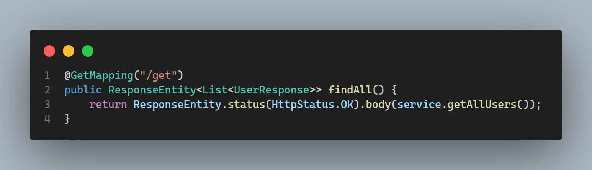
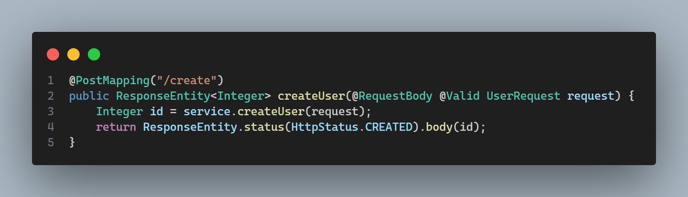

# Fluxo-Usuario
#### [Swagger](http://localhost:8080/swagger-ui/index.html)

### 
 Usuario Controller

#### Recebe uma requisição do tipo `GET` para retornar todos os usuários cadastrados.
---

 

#### Recebe uma requisição do tipo `GET` para retornar o usuario cadastrado a partir do login informado, quando for o caso.
---

 

#### Recebe uma requisição do tipo `POST` para `CADASTRAR` usuario e responde com o usuario cadastrado.
#### Caso o usuario tentar se `CADASTRAR` e retornar com o usuario existente, ja existe um usuario com informações requisitadas ja em uso no banco.
---

 

#### Recebe uma requisição do tipo `DELETE` para excluir o usuario a partir do login informado e responde com a confirmação da exclusão.
#### Ou quando acontece um erro ele retorna com a impossibilidade de exclusão e a justificativa do erro.
---

### 
Postman em manutenção 

👨🏾‍🔧[Postman Documentação](https://documenter.getpostman.com/view/38340143/2sAY4vi3vF) 👨🏾‍🔧 

#### Todo o teste da API e seu funcionamento.  
#### Quando você clicar iniciar o programa, acesse o mapeamento do utilizando o site acima. 

